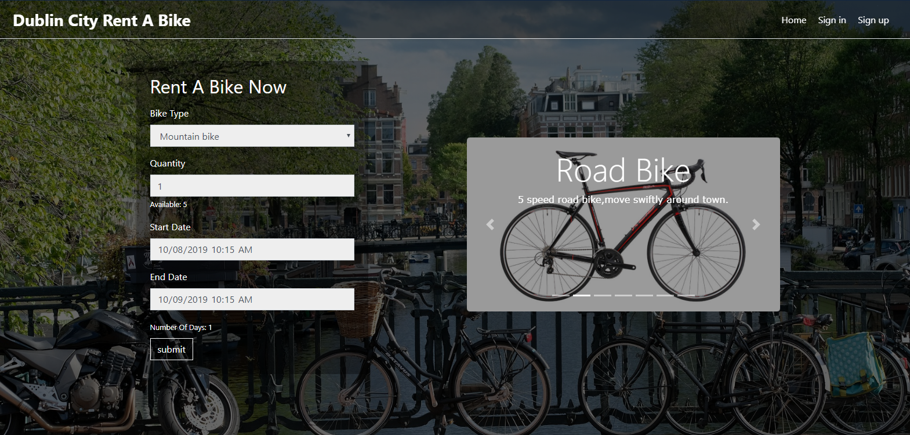

# DC(Dublin City) Rent-a-bike App

Ruby on Rails Rent-a-bike booking web app for  Dublin City.

Developed on the AWS C9 enviroment and deployed to Heroku.

URL- https://dcrentabike23.herokuapp.com/

Ruby -v- 2.5.1

Rails-v- 5.1.6

# Gems
See Gemfile

Devise for authentication

PG - postgres-10 d/b.

## Run locally - localhost3000
```
$ cd DCrentabike

$ sudo apt-get install libpq-dev

$	bundle install

$ rake db:migrate

$ rails db:seed

$ rails s
```

## Images -Home page



* ...
Sign up and in to book a bike.
